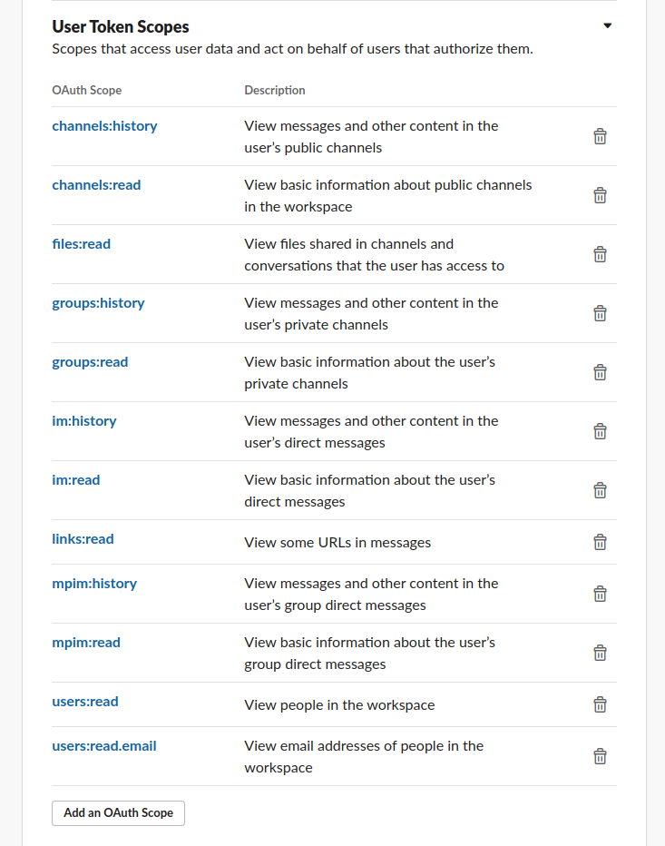
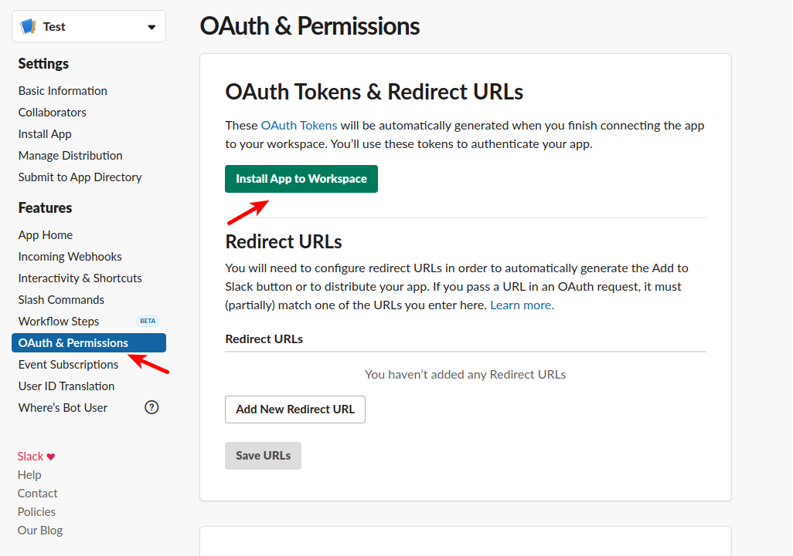
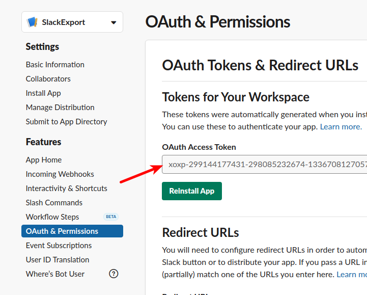

# Slack Exporter

## Step 1 - Prepare Slack API Access Token

Create s Slack API Application which will be used to get access token.

Grant needed scopes to your app as listed here:



Get the token by installing the app to your workspace:



Copy the token:



Export the token in system variable:
```bash
export SLACK_API_TOKEN=xoxp-299...
```

## Step 2 - Export Slack Conversations

Get from the Slack API all your conversations.

There are these types:
* public channels
* private channels
* group chats
* direct messages

Execute this python script:
```bash
python3 src/slack-exporter.py
```

It will use the `SLACK_API_TOKEN` from Step 1.

## Step 3 - Download Files

Extract all slack links to files/thumbs to download:
```bash
get-slack-links.sh
```

This will generate 2 files:
* `links/slack-edge-links.txt` - holds avatars
* `links/slack-links.txt` - holds all slack files/thumbs

There are links that duplicate the files for example:
```bash
https://files.slack.com/files-pri/T8T4857CP-FJ2EJ3RHC/solpad_infra_additional_work.jpg
https://files.slack.com/files-pri/T8T4857CP-FJ2EJ3RHC/download/solpad_infra_additional_work.jpg
```

Remove all the `.../download/...` links to reduce duplication download.

Use this regexp to remove them: `.*/download/.*\n`

Also remove all thumbnail files that are for images with fixed size with this:
```
https\:\/\/files\.slack\.com\/files\-tmb.*(_[0-9]*\.).*\n
```

Most of these thumbnails will be generated from the viewer if there is the original file exists.

After removing the download links and thumbs links proceed to download.

Create a directory: `./exported/_files_`

Go to that directory and use the `wget-all-files.sh` to download the slack fiels.

Use `wget-all-files-no-token.sh` to download the avatar files.

After download you should have these directory structure:
```bash
exported/_files_/avatars.slack-edge.com/2018-01-24/303893856389_53a21fc597b96297af57_24.jpg
exported/_files_/avatars.slack-edge.com/2018-01-24/303893856389_53a21fc597b96297af57_32.jpg
exported/_files_/avatars.slack-edge.com/2018-01-24/303893856389_53a21fc597b96297af57_48.jpg
...
exported/_files_/avatars.slack-edge.com/2018-01-26
exported/_files_/avatars.slack-edge.com/2018-01-26/305097714435_009b53a33d300c3526fa_24.png
exported/_files_/avatars.slack-edge.com/2018-01-26/305097714435_009b53a33d300c3526fa_32.png
...

exported/_files_/files.slack.com/files-pri/T8T4857CP-F8WLL59PT
exported/_files_/files.slack.com/files-pri/T8T4857CP-F8X2C6YCT
exported/_files_/files.slack.com/files-pri/T8T4857CP-F8XQ3DTHS
...
exported/_files_/files.slack.com/files-tmb/T8T4857CP-F8Z2JTCBD-cabcac485c
exported/_files_/files.slack.com/files-tmb/T8T4857CP-F9B3EDNFP-4c2aa8ede3
exported/_files_/files.slack.com/files-tmb/T8T4857CP-F9B6F4WMP-e7e06e2449
```

For some thumbnails the original files are no longer in the slack servers.

So execute this:
```bash
python3 src/check-thumbs-only-links.py
``` 

It will create a new file with links that are of thumbnails which should be downloaded additionally.

Use with the same as above the `wget-all-files.sh` to download them.

# Step 4 - Prepare Exported Data

As we use a modified version of the `slack-export-viewer` to handle
locally downloaded files/thumbs we need to replace the links in the messages.

Execute this: `replace-local-files.sh`

# Step 5 - Start Slack Export Viewer

Execute this: 
```bash
./slack-export-viewer -z ./exported -p 5000
```

It will start a Python Flask app listening on http://localhost:5000

Where you could browse your exported data.

